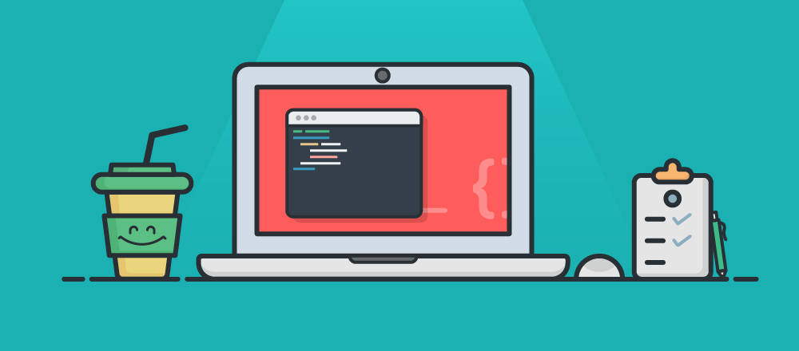

# Hi 👋, I'm Dinesh

 

 

## About Me

- 📒 I’m currently learning **Java, Spring, and Hibernate** and working on side projects.

- 🤝🏻 I’m passionate about design and development and look forward to collaborating to **Open source Projects**.

- 🌎 I'm exploring **web development**, **android development**, **artificial intelligence** and **machine learning**.

- 💬 Feel free to reach out: DM [@Aliencoder_75](https://twitter.com/Aliencoder_75)

 

## Languages & Databases

 

## Tools & OperatingSystem

 

## Get In Touch

 

## GitHub statistics

<!-- 

  

 -->
 

  

